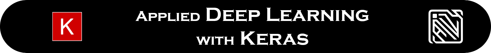
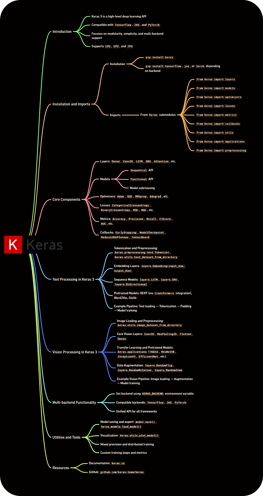

<div align="center">
 



[](https://www.python.org/)
[](https://jupyter.org/)
[](https://keras.io/)
[](https://www.tensorflow.org/)

[-00C853?style=for-the-badge&logo=checkmarx&logoColor=white)](https://github.com/mohd-faizy/applied-deep-learning-keras)
[](https://github.com/mohd-faizy/applied-deep-learning-keras)
[](https://github.com/mohd-faizy)

</div>

---

# Applied Deep Learning with Keras

This repository contains a comprehensive collection of notebooks implementing Deep Learning architectures using **Keras**. It covers a wide range of topics from foundational concepts to advanced techniques, including Convolutional Neural Networks (CNNs), Recurrent Neural Networks (RNNs), Autoencoders, and Transfer Learning.

<div align="center">
  
</div>

## 📚 Notebook Catalog

| Notebook | Description |
| :--- | :--- |
| [01_Keras_Intro.ipynb](01_Keras_Intro.ipynb) | Introduction to Keras Functional and Sequential APIs. |
| [02_Classification.ipynb](02_Classification.ipynb) | Binary and Multi-class classification problems. |
| [03_Model_Tuning.ipynb](03_Model_Tuning.ipynb) | Hyperparameter tuning and model optimization techniques. |
| [04_Autoencoders.ipynb](04_Autoencoders.ipynb) | Unsupervised learning and dimensionality reduction with Autoencoders. |
| [05_Dense_Layers.ipynb](05_Dense_Layers.ipynb) | Deep dive into fully connected layers and architectures. |
| [06_Embeddings.ipynb](06_Embeddings.ipynb) | Learning vector representations for categorical data. |
| [07_Multi_Input.ipynb](07_Multi_Input.ipynb) | Building models that accept multiple inputs. |
| [08_Multi_Output.ipynb](08_Multi_Output.ipynb) | Designing architectures with multiple output branches. |
| [09_CNN_Intro.ipynb](09_CNN_Intro.ipynb) | Foundations of Convolutional Neural Networks. |
| [10_Convolutions.ipynb](10_Convolutions.ipynb) | Understanding convolution operations and filters. |
| [11_Deep_Pooling.ipynb](11_Deep_Pooling.ipynb) | Advanced pooling strategies for feature extraction. |
| [12_Reg_Interp.ipynb](12_Reg_Interp.ipynb) | Regularization techniques and model interpretability. |
| [13_RNN_Intro.ipynb](13_RNN_Intro.ipynb) | Introduction to Recurrent Neural Networks. |
| [14_LSTM_GRU.ipynb](14_LSTM_GRU.ipynb) | Long Short-Term Memory (LSTM) and Gated Recurrent Units (GRU). |
| [15_Text_Transfer.ipynb](15_Text_Transfer.ipynb) | Transfer Learning for Natural Language Processing tasks. |
| [16_Seq2Seq.ipynb](16_Seq2Seq.ipynb) | Sequence-to-Sequence models for translation and generation. |

---

## 🛠️ Installation & Requirements

To run these notebooks, you'll need Python installed. It is recommended to use a virtual environment.

```bash
# Clone the repository
git clone https://github.com/mohd-faizy/applied-deep-learning-keras.git

# Navigate to the directory
cd applied-deep-learning-keras

# Create a virtual environment using UV package manager
uv venv 

# Activate the virtual environment
# Windows
.venv\Scripts\activate
# Linux/macOS
source .venv/bin/activate

# Install dependencies
uv sync
# OR using pip
pip install -r requirements.txt
```

---

## ⭐ Deep Learning Components

| **Category** | **Component** | **Description** |
| :--- | :--- | :--- |
| **Foundation** | **Dense Layers** | Fully connected layers, the building blocks of deep neural networks (MLPs). |
| | **Activation Functions** | Non-linearities (ReLU, Sigmoid, Tanh, Swish) that allow networks to learn complex patterns. |
| | **Backpropagation** | The core algorithm for computing gradients and training neural networks. |
| **Optimization** | **Loss Functions** | Metrics (MSE, Cross-Entropy, Focal Loss) that quantify prediction error. |
| | **Optimizers** | Algorithms (Adam, SGD, RMSprop) that update weights to minimize loss. |
| | **Regularization** | Techniques (Dropout, L1/L2, Batch Norm, Early Stopping) to prevent overfitting. |
| **Vision (CNN)** | **Convolutions** | Feature extraction layers that learn spatial hierarchies in images. |
| | **Pooling** | Down-sampling operations (Max, Average) to reduce dimensionality and computation. |
| | **Data Augmentation** | Generating new training samples from existing data to improve generalization. |
| **Sequences (RNN)** | **Recurrent Layers** | RNNs, LSTMs, and GRUs for processing temporal or sequential data. |
| | **Embeddings** | Dense vector representations for words or categorical entities (Word2Vec, GloVe). |
| | **Attention** | Mechanism allowing models to focus on specific parts of the input sequence. |
| **Generative** | **Autoencoders** | Networks trained to reconstruct inputs, used for denoising and representation learning. |
| | **VAEs** | Variational Autoencoders for generating new data from a learned latent space. |
| | **GANs** | Generative Adversarial Networks: a generator competing with a discriminator. |
| **Advanced** | **Transfer Learning** | Leveraging pre-trained models (VGG, ResNet, BERT) for new tasks with limited data. |
| | **Multi-Modal** | Architectures handling diverse data types (e.g., Image + Text). |

---

## 🧠 Important Papers (Updated – 2026)

> A curated list of landmark papers that every Deep Learning practitioner should know.

### 📌 Foundations & Optimization
| Paper | Authors | Year | Key Contribution | Link |
| :--- | :--- | :--- | :--- | :--- |
| **Learning Representations by Back-propagating Errors** | Rumelhart, Hinton, Williams | 1986 | Popularized Backpropagation. | [Nature](https://www.nature.com/articles/323533a0) |
| **Adam: A Method for Stochastic Optimization** | Kingma, Ba | 2014 | Adaptive learning rate optimization. | [arXiv](https://arxiv.org/abs/1412.6980) |
| **Dropout: A Simple Way to Prevent Neural Networks from Overfitting** | Srivastava et al. | 2014 | Canonical regularization technique. | [JMLR](http://jmlr.org/papers/v15/srivastava14a.html) |
| **Batch Normalization** | Ioffe, Szegedy | 2015 | Stabilizing and accelerating training. | [arXiv](https://arxiv.org/abs/1502.03167) |

### 📌 Computer Vision (CNN Architectures)
| Paper | Authors | Year | Key Contribution | Link |
| :--- | :--- | :--- | :--- | :--- |
| **ImageNet Classification with Deep Convolutional Neural Networks (AlexNet)** | Krizhevsky et al. | 2012 | Deep Learning breakthrough in Vision. | [NIPS](https://papers.nips.cc/paper/4824-imagenet-classification-with-deep-convolutional-neural-networks) |
| **Very Deep Convolutional Networks for Large-Scale Image Recognition (VGG)** | Simonyan, Zisserman | 2014 | Small filters, deep architectures. | [arXiv](https://arxiv.org/abs/1409.1556) |
| **Deep Residual Learning for Image Recognition (ResNet)** | He et al. | 2015 | Residual connections allowing 100+ layers. | [arXiv](https://arxiv.org/abs/1512.03385) |
| **MobileNets: Efficient Convolutional Neural Networks** | Howard et al. | 2017 | Efficient Depthwise Separable Convolutions. | [arXiv](https://arxiv.org/abs/1704.04861) |

### 📌 Sequence Modeling & NLP
| Paper | Authors | Year | Key Contribution | Link |
| :--- | :--- | :--- | :--- | :--- |
| **Long Short-Term Memory (LSTM)** | Hochreiter, Schmidhuber | 1997 | Solved vanishing gradients in RNNs. | [Neural Computation](https://www.mitpressjournals.org/doi/10.1162/neco.1997.9.8.1735) |
| **Neural Machine Translation by Jointly Learning to Align and Translate** | Bahdanau et al. | 2014 | Introduced Attention mechanisms. | [arXiv](https://arxiv.org/abs/1409.0473) |
| **Attention Is All You Need** | Vaswani et al. | 2017 | The Transformer architecture. | [arXiv](https://arxiv.org/abs/1706.03762) |
| **BERT: Pre-training of Deep Bidirectional Transformers** | Devlin et al. | 2018 | Masked Language Modeling revolution. | [arXiv](https://arxiv.org/abs/1810.04805) |

### 📌 Generative Models
| Paper | Authors | Year | Key Contribution | Link |
| :--- | :--- | :--- | :--- | :--- |
| **Auto-Encoding Variational Bayes (VAE)** | Kingma, Welling | 2013 | Probabilistic generative models. | [arXiv](https://arxiv.org/abs/1312.6114) |
| **Generative Adversarial Networks (GAN)** | Goodfellow et al. | 2014 | Adversarial training framework. | [arXiv](https://arxiv.org/abs/1406.2661) |
| **A Style-Based Generator Architecture for Generative Adversarial Networks (StyleGAN)** | Karras et al. | 2018 | High-quality image generation. | [arXiv](https://arxiv.org/abs/1812.04948) |

---

## License

MIT

## Connect with me

<div align="center">

[](https://twitter.com/F4izy)
[](https://www.linkedin.com/in/mohd-faizy/)
[](https://ai.stackexchange.com/users/36737/faizy)
[](https://github.com/mohd-faizy)

</div>
